# CS193P-assignments
The solutions for each assignment presented in Stanford's "developing iOS 11 apps with swift" course.

## Concentration:

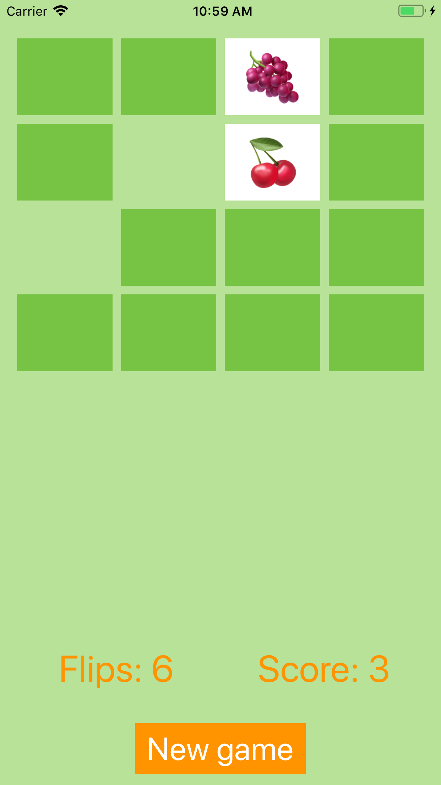

## Set:

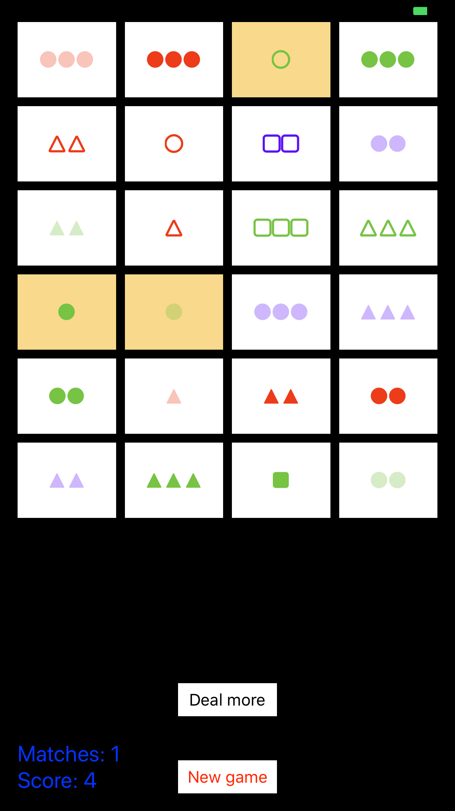

## Graphical set:

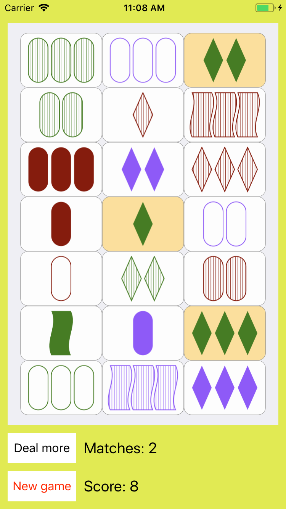

## Animated set:

A blog post about my experiences while building the project: https://tiagomaiadotblog.wordpress.com/2018/03/16/animated-set-cs193p-fall-of-2017-assignment-iv-solution/

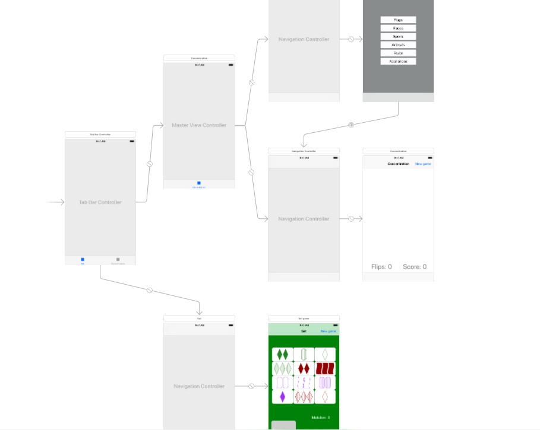
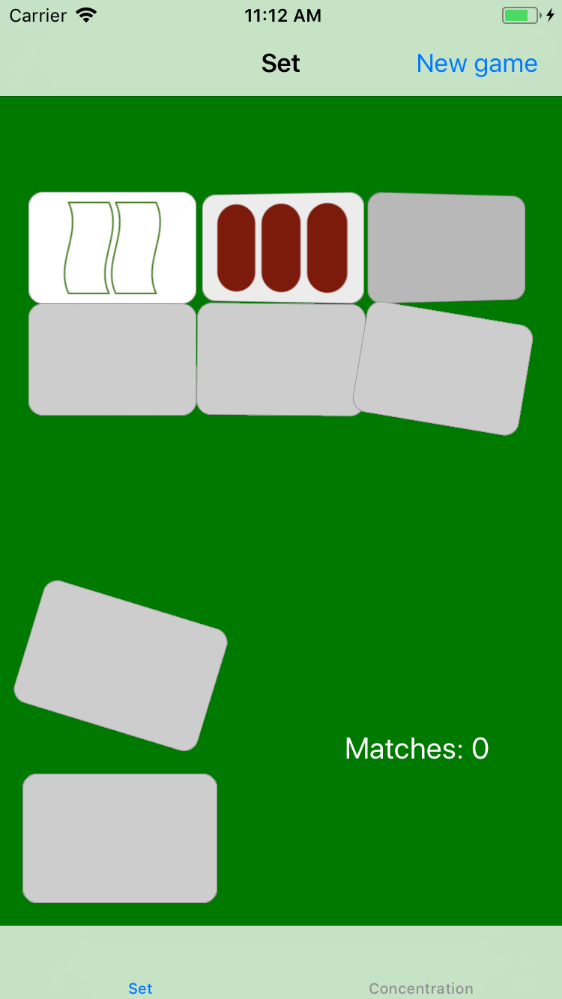
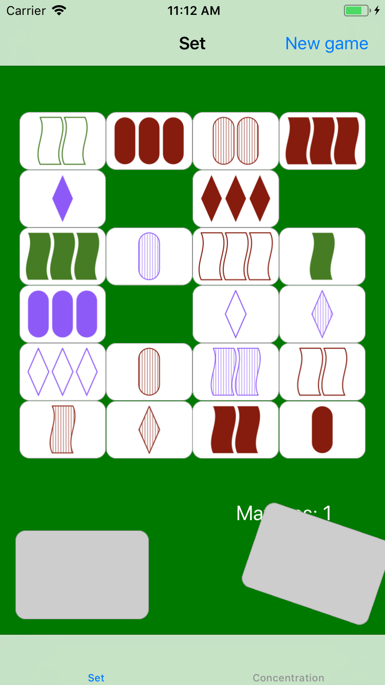
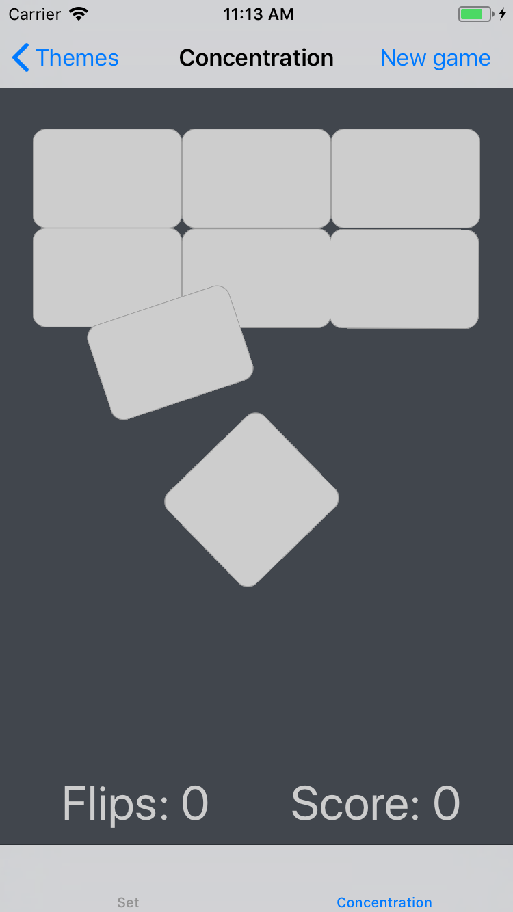

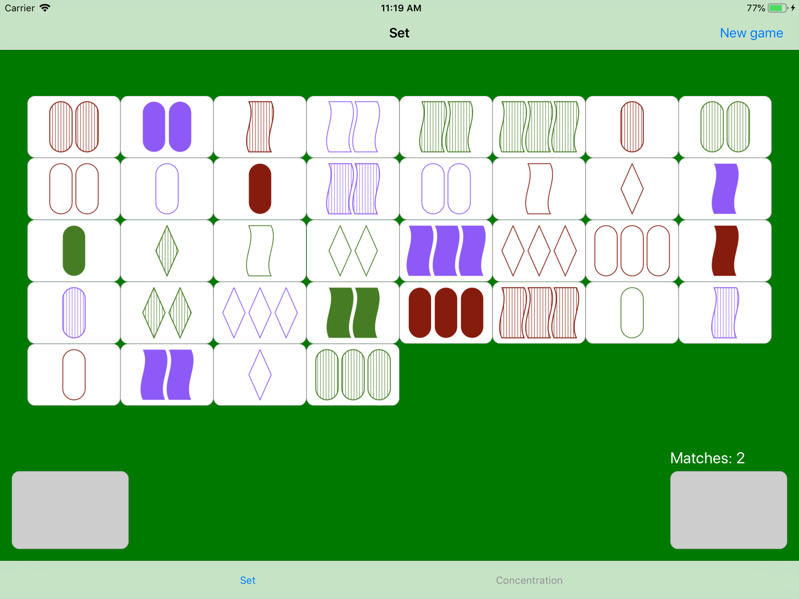
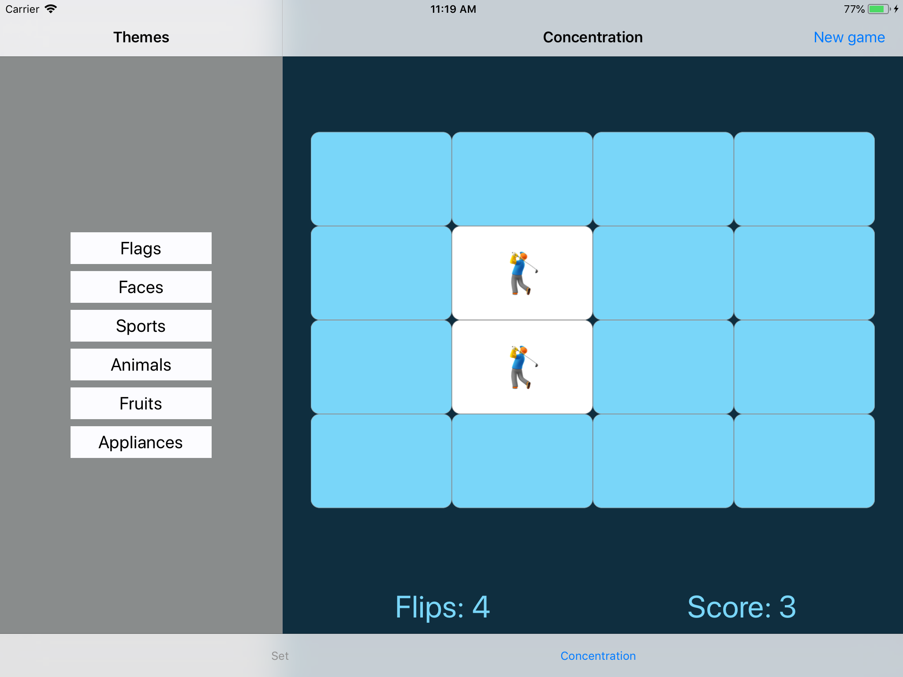

## Image gallery:

A blog post about my experiences while building the project: https://tiagomaiadotblog.wordpress.com/2018/04/03/image-gallery-cs193p-fall-of-2017-assignment-v-solution/

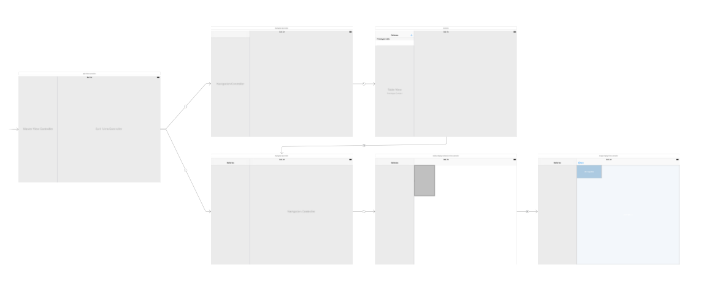
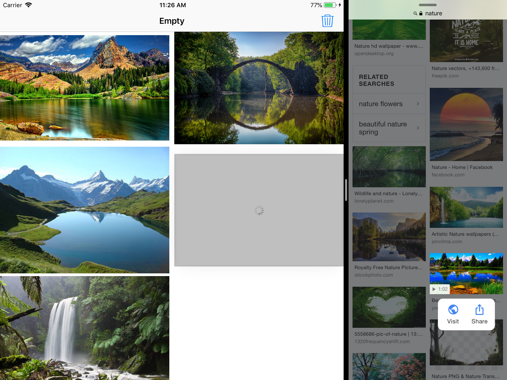
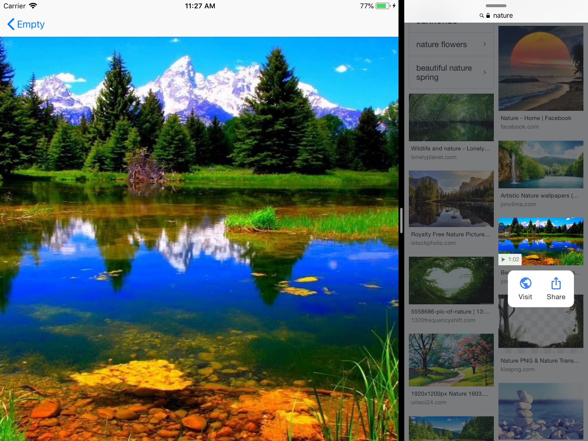

## Persistent image gallery:

A blog post about my experiences while building the project: https://tiagomaiadotblog.wordpress.com/2018/04/11/persistent-image-gallery-cs193p-fall-of-2017-assignment-vi-solution/

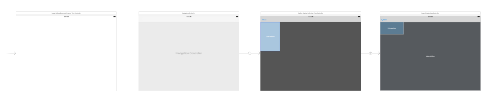
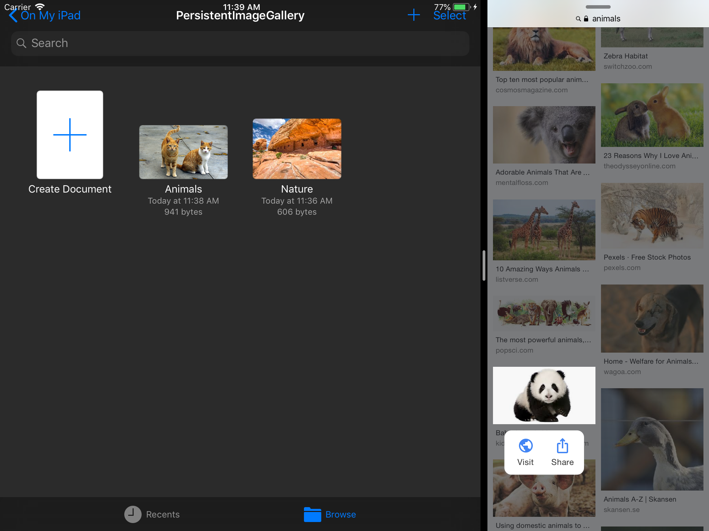
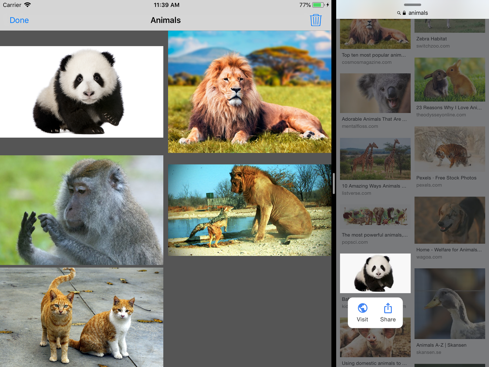
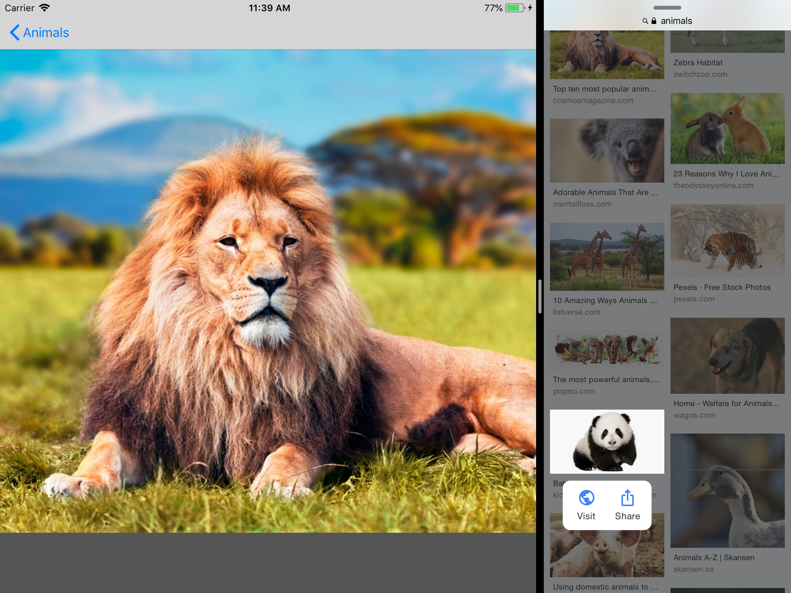

## Final project

My final project is currently being developed at the following repository: https://github.com/TiagoMaiaL/Habit-Calendar.
